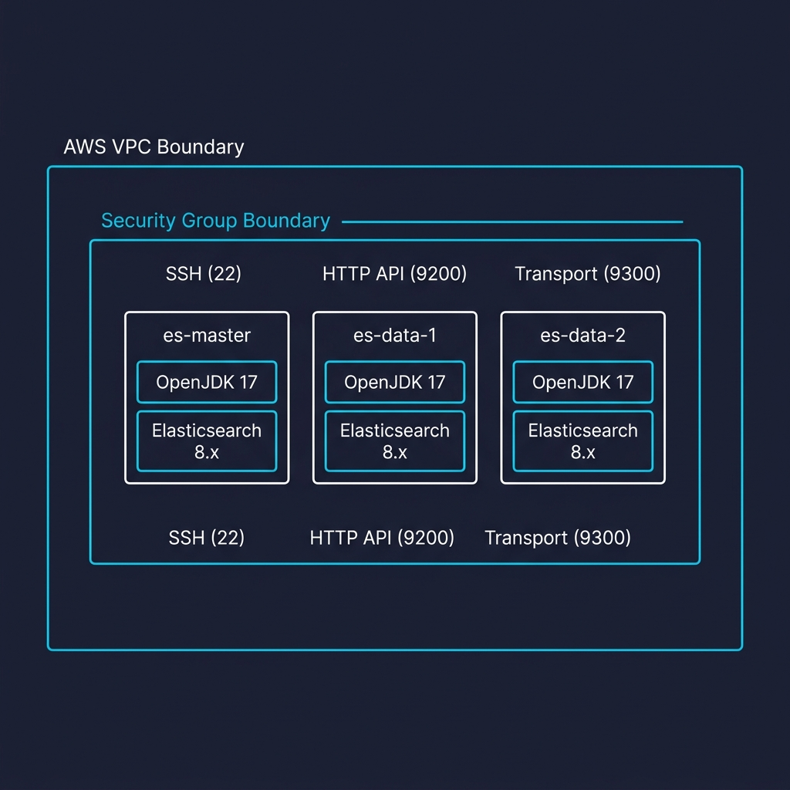

# Lab 49: Cluster Provisioning

**Module 76 — Elasticsearch Cluster Setup**

This lab provisions three Elasticsearch nodes on AWS EC2. Each node is its own Ubuntu 24.04 instance with a dedicated role — master, data, or data+ingest — running in the same VPC so they can discover each other over the private network. By the end you have three running Elasticsearch instances ready to be wired into a cluster in the next lab.

## Architecture

<p align="center"></p>

## Concept

| Term                | Description                                                                                            |
|---------------------|--------------------------------------------------------------------------------------------------------|
| EC2 Instance        | A virtual server in AWS. Each Elasticsearch node runs on its own instance.                              |
| VPC                 | An isolated virtual network in AWS. All three nodes live in the same VPC so they can talk privately.   |
| Subnet             | A range of IP addresses inside a VPC. The three nodes are placed in the same private subnet.           |
| Security Group      | A virtual firewall attached to each instance. Controls inbound and outbound traffic at the instance level. |
| Key Pair            | A public/private key pair used for SSH access. AWS stores the public key; you keep the private `.pem`.  |
| User Data           | A shell script that runs once when an instance first boots. Used here to install Java and Elasticsearch automatically. |
| AMI                 | An Amazon Machine Image — the template for an instance's root volume. Ubuntu 24.04 LTS in this lab.    |
| Port 9200           | The HTTP port Elasticsearch exposes for REST API requests (indexing, searching, cluster health).       |
| Port 9300           | The transport port nodes use to talk to each other for cluster coordination and data replication.      |
| `t3.medium`         | A burstable general-purpose instance type — 2 vCPU, 4 GB RAM. Sized for three small Elasticsearch nodes. |

Three EC2 instances in the same VPC are the production equivalent of three Docker containers in one compose file. Each instance gets a stable private IP and DNS name that the others use for discovery. The instance's EBS root volume replaces the Docker named volume so data and cluster state survive instance restarts.

## What You Will Build

Three Elasticsearch 8.x instances running in one VPC, networked together:

| Node           | Instance Type  | Private IP (example) | Role             | Purpose                                    |
|----------------|----------------|----------------------|------------------|--------------------------------------------|
| `es-master`    | `t3.medium`    | `10.0.1.10`          | `[master]`       | Dedicated cluster manager — no data stored |
| `es-data-1`    | `t3.medium`    | `10.0.1.11`          | `[data]`         | Stores index shards, runs queries          |
| `es-data-2`    | `t3.medium`    | `10.0.1.12`          | `[data, ingest]` | Stores shards and runs ingest pipelines    |

All three nodes bind port 9200 (HTTP) and 9300 (transport) on the instance. The lab only installs and starts Elasticsearch with a minimal config — the next lab assigns the distinct roles and brings the cluster up.

## Prerequisites

You need an AWS account with permissions to launch EC2 instances, create security groups, create key pairs, and read VPC/subnet metadata.

- **AWS account** with the credentials exported as environment variables:
  ```bash
  export AWS_ACCESS_KEY_ID=<your-key>
  export AWS_SECRET_ACCESS_KEY=<your-secret>
  export AWS_DEFAULT_REGION=us-east-1
  ```
  Replace `us-east-1` with the region you want to use. If you do not export credentials, every `aws` command below will fail with `Unable to locate credentials`.
- **AWS CLI v2** installed and working:
  ```bash
  aws --version
  aws sts get-caller-identity
  ```
  `get-caller-identity` should print your account ARN without an error.
- **SSH client** (OpenSSH on Linux/macOS, or `ssh` in PowerShell on Windows).
- A **key pair** in your target region. The next step creates one if you do not already have one.
- The lab creates three `t3.medium` instances. Each needs ~1 GB of free heap (Elasticsearch default 512m × 2 = 1 GB), plus the OS. `t3.medium` ships with 4 GB RAM, which fits comfortably.

> **Cost note.** `t3.medium` in `us-east-1` is roughly $0.04/hr per instance (about $0.12/hr for all three). Stop the instances or run `terminate-instances` at the end of the lab to avoid surprise charges. The lab's final teardown step (Step 13) handles this.

## Step 1: Verify AWS access

Confirm your credentials are loaded and you can read your account ID:

```bash
aws sts get-caller-identity
```

Expected output (your account ID and user ARN will differ):

```json
{
    "UserId": "AIDAXXXXXXXXXXXXXXXX",
    "Account": "123456789012",
    "Arn": "arn:aws:iam::123456789012:user/your-user"
}
```

If you see `Unable to locate credentials`, the environment variables from the prerequisites are not set in the current shell. Re-export them and retry.

## Step 2: Pick a region and confirm a VPC exists

Pick the region you will use everywhere in this lab:

```bash
export AWS_REGION=us-east-1
```

Confirm at least one VPC exists in the region. Every AWS account has a default VPC in every region:

```bash
aws ec2 describe-vpcs \
  --region "$AWS_REGION" \
  --query 'Vpcs[].{VpcId:VpcId,CidrBlock:CidrBlock,IsDefault:IsDefault}' \
  --output table
```

Expected output: at least one VPC row. Note the `VpcId` of the default VPC (`IsDefault: True`) — the next steps use it.

If the table is empty, create the default VPC manually:

```bash
aws ec2 create-default-vpc --region "$AWS_REGION"
```

## Step 3: Create a key pair

A key pair lets you SSH into the instances. AWS stores the public key; you download the private `.pem`.

```bash
mkdir -p ~/lab-49
cd ~/lab-49
aws ec2 create-key-pair \
  --region "$AWS_REGION" \
  --key-name es-lab-key \
  --query 'KeyMaterial' \
  --output text > es-lab-key.pem
chmod 600 es-lab-key.pem
```

Verify the file exists and has the correct permissions:

```bash
ls -l es-lab-key.pem
```

Expected output:

```
-rw------- 1 user user 1675 Sep 14 11:00 es-lab-key.pem
```

The mode `-rw-------` (octal `600`) is required — SSH refuses to use a key with looser permissions.

## Step 4: Create a security group

The security group opens SSH (22) from your IP and Elasticsearch HTTP (9200) + transport (9300) between the three nodes:

```bash
VPC_ID=$(aws ec2 describe-vpcs \
  --region "$AWS_REGION" \
  --filters Name=isDefault,Values=true \
  --query 'Vpcs[0].VpcId' \
  --output text)

SG_ID=$(aws ec2 create-security-group \
  --region "$AWS_REGION" \
  --group-name es-lab-sg \
  --description "Elasticsearch lab - SSH from my IP, ES traffic inside VPC" \
  --vpc-id "$VPC_ID" \
  --query 'GroupId' \
  --output text)

echo "Security group: $SG_ID"
```

Save the `Security group: sg-xxxxxxxxxxxxxxxxx` line — the next steps use `$SG_ID` to authorise traffic.

Open SSH from your current public IP:

```bash
MY_IP=$(curl -s https://checkip.amazonaws.com)/32

aws ec2 authorize-security-group-ingress \
  --region "$AWS_REGION" \
  --group-id "$SG_ID" \
  --protocol tcp \
  --port 22 \
  --cidr "$MY_IP"
```

Open Elasticsearch ports to the VPC CIDR so the three nodes can talk to each other:

```bash
VPC_CIDR=$(aws ec2 describe-vpcs \
  --region "$AWS_REGION" \
  --vpc-ids "$VPC_ID" \
  --query 'Vpcs[0].CidrBlock' \
  --output text)

aws ec2 authorize-security-group-ingress \
  --region "$AWS_REGION" \
  --group-id "$SG_ID" \
  --protocol tcp \
  --port 9200 \
  --cidr "$VPC_CIDR"

aws ec2 authorize-security-group-ingress \
  --region "$AWS_REGION" \
  --group-id "$SG_ID" \
  --protocol tcp \
  --port 9300 \
  --cidr "$VPC_CIDR"
```

Verify the three rules:

```bash
aws ec2 describe-security-groups \
  --region "$AWS_REGION" \
  --group-ids "$SG_ID" \
  --query 'SecurityGroups[].IpPermissions[].{Port:FromPort,Proto:IpProtocol,Source:IpRanges[].CidrIp}' \
  --output table
```

Expected: rows for port `22` (your IP), `9200` (VPC CIDR), and `9300` (VPC CIDR).

## Step 5: Find the latest Ubuntu 24.04 LTS AMI

Canonical publishes official Ubuntu AMIs under owner `099720109477`. Use the `describe-images` API to find the newest 24.04 server image:

```bash
AMI_ID=$(aws ec2 describe-images \
  --region "$AWS_REGION" \
  --owners 099720109477 \
  --filters \
    Name=name,Values=ubuntu/images/hvm-ssd-gp3/ubuntu-noble-24.04-amd64-server-* \
    Name=state,Values=available \
  --query 'sort_by(Images, &CreationDate)[-1].ImageId' \
  --output text)

echo "Ubuntu 24.04 AMI: $AMI_ID"
```

If you prefer a frozen AMI (reproducible across lab restarts), pin a specific ID from the AWS console — `describe-images` always returns the latest, which can change week to week.

## Step 6: Write the user-data script

User data runs once when the instance first boots. This script installs Java 17, the Elasticsearch APT repo, the `elasticsearch` 8.x package, pins the heap to 512m, and starts the service:

```bash
cat > user-data.sh <<'USERDATA'
#!/bin/bash
set -euo pipefail

# Install Java 17 (headless — Elasticsearch does not need the full JDK)
apt-get update -y
apt-get install -y openjdk-17-jdk-headless wget gnupg apt-transport-https

# Add the Elasticsearch GPG key and APT repository
wget -qO - https://artifacts.elastic.co/GPG-KEY-elasticsearch \
  | gpg --dearmor -o /usr/share/keyrings/elasticsearch-keyring.gpg
echo "deb [signed-by=/usr/share/keyrings/elasticsearch-keyring.gpg] https://artifacts.elastic.co/packages/8.x/apt stable main" \
  > /etc/apt/sources.list.d/elastic-8.x.list
apt-get update -y
apt-get install -y elasticsearch

# Pin a smaller heap so three t3.medium instances stay under 4 GB RAM each
echo "-Xms512m"  > /etc/elasticsearch/jvm.options.d/heap.options
echo "-Xmx512m" >> /etc/elasticsearch/jvm.options.d/heap.options

systemctl daemon-reload
systemctl enable --now elasticsearch.service
USERDATA

chmod +x user-data.sh
```

The `'USERDATA'` delimiter is quoted so `$` inside the heredoc body is not expanded by your local shell — the script runs verbatim on the EC2 instance.

## Step 7: Launch the three instances

Launch one instance per role. The `--tag-specifications` give each instance a `Name` tag so they are easy to identify in the EC2 console:

```bash
USER_DATA="file://$PWD/user-data.sh"

aws ec2 run-instances \
  --region "$AWS_REGION" \
  --image-id "$AMI_ID" \
  --instance-type t3.medium \
  --key-name es-lab-key \
  --security-group-ids "$SG_ID" \
  --user-data "$USER_DATA" \
  --count 1 \
  --tag-specifications 'ResourceType=instance,Tags=[{Key=Name,Value=es-master}]' \
  --query 'Instances[0].InstanceId' \
  --output text > es-master.id

aws ec2 run-instances \
  --region "$AWS_REGION" \
  --image-id "$AMI_ID" \
  --instance-type t3.medium \
  --key-name es-lab-key \
  --security-group-ids "$SG_ID" \
  --user-data "$USER_DATA" \
  --count 1 \
  --tag-specifications 'ResourceType=instance,Tags=[{Key=Name,Value=es-data-1}]' \
  --query 'Instances[0].InstanceId' \
  --output text > es-data-1.id

aws ec2 run-instances \
  --region "$AWS_REGION" \
  --image-id "$AMI_ID" \
  --instance-type t3.medium \
  --key-name es-lab-key \
  --security-group-ids "$SG_ID" \
  --user-data "$USER_DATA" \
  --count 1 \
  --tag-specifications 'ResourceType=instance,Tags=[{Key=Name,Value=es-data-2}]' \
  --query 'Instances[0].InstanceId' \
  --output text > es-data-2.id

cat es-master.id es-data-1.id es-data-2.id
```

Each `run-instances` call returns immediately with an instance ID (the file `es-master.id` and friends store them). Wait for the instances to reach `running` state — that takes 1–3 minutes:

```bash
for f in es-master.id es-data-1.id es-data-2.id; do
  INSTANCE_ID=$(cat "$f")
  echo "Waiting for $INSTANCE_ID..."
  aws ec2 wait instance-running \
    --region "$AWS_REGION" \
    --instance-ids "$INSTANCE_ID"
  echo "  $INSTANCE_ID is running"
done
```

The `wait` subcommand blocks until the instance state is `running`. The user-data script continues running in the background — Step 9 polls for Elasticsearch to come up.

## Step 8: Get the public IPs and SSH into es-master

Fetch the public IPs for SSH access:

```bash
> instances.txt
for f in es-master.id es-data-1.id es-data-2.id; do
  INSTANCE_ID=$(cat "$f")
  PUBLIC_IP=$(aws ec2 describe-instances \
    --region "$AWS_REGION" \
    --instance-ids "$INSTANCE_ID" \
    --query 'Reservations[0].Instances[0].PublicIpAddress' \
    --output text)
  echo "$INSTANCE_ID $PUBLIC_IP" >> instances.txt
done

cat instances.txt
```

Expected output (IPs will differ):

```
i-0aaa1111aaaa1111aa 54.123.45.67
i-0bbb2222bbbb2222bb 54.123.45.68
i-0ccc3333cccc3333cc 54.123.45.69
```

Save the master public IP into a variable and confirm SSH works:

```bash
ES_MASTER_IP=$(awk -v id="$(cat es-master.id)" '$1==id{print $2}' instances.txt)
echo "es-master public IP: $ES_MASTER_IP"

ssh -i es-lab-key.pem -o StrictHostKeyChecking=accept-new \
  ubuntu@"$ES_MASTER_IP" 'echo connected && hostname'
```

If the SSH connection times out, check that the security group's port 22 rule allows your current public IP (`curl -s https://checkip.amazonaws.com`) and that the instance has a public IP assigned.

## Step 9: Wait for Elasticsearch to come up on es-master

The user-data script installs Java, Elasticsearch, and starts the service. It takes 2–4 minutes on a fresh `t3.medium`. Poll the local API from inside the instance:

```bash
ssh -i es-lab-key.pem ubuntu@"$ES_MASTER_IP" \
  'for i in $(seq 1 60); do
     if curl -sf http://localhost:9200 >/dev/null 2>&1; then
       echo "Elasticsearch up after ${i} attempts"
       curl -s http://localhost:9200
       exit 0
     fi
     sleep 5
   done
   echo "Elasticsearch did not come up in time"
   sudo journalctl -u elasticsearch --no-pager -n 100
   exit 1'
```

Expected output once Elasticsearch is ready:

```json
{
  "name" : "es-master",
  "cluster_name" : "elasticsearch",
  "cluster_uuid" : "...",
  "version" : {
    "number" : "8.13.4",
    ...
  },
  "tagline" : "You Know, for Search"
}
```

If the script prints `Elasticsearch did not come up in time` followed by a `journalctl` dump, common causes are:

- `vm.max_map_count` too low — fix with `sudo sysctl -w vm.max_map_count=262144 && sudo systemctl restart elasticsearch`.
- Disk space — the default 8 GB gp3 root volume can fill up during installation. Resize the volume or use a larger instance type.
- APT mirror unreachable — retry, or use a different region with better mirror coverage.

## Step 10: Verify Elasticsearch on each data node

Save the data node public IPs:

```bash
ES_DATA1_IP=$(awk -v id="$(cat es-data-1.id)" '$1==id{print $2}' instances.txt)
ES_DATA2_IP=$(awk -v id="$(cat es-data-2.id)" '$1==id{print $2}' instances.txt)
```

```bash
ssh -i es-lab-key.pem -o StrictHostKeyChecking=accept-new \
  ubuntu@"$ES_DATA1_IP" \
  'curl -s http://localhost:9200 | python3 -m json.tool'

ssh -i es-lab-key.pem -o StrictHostKeyChecking=accept-new \
  ubuntu@"$ES_DATA2_IP" \
  'curl -s http://localhost:9200 | python3 -m json.tool'
```

Expected output on each: the same JSON shape from Step 9, with `"name"` matching the instance's auto-generated node name. `cluster_name` reads `elasticsearch` (the default) on all three — they are not yet wired together; the next lab sets `cluster.name` and `discovery.seed_hosts` so the three nodes form a single cluster.

## Step 11: Confirm the security group allows 9200 and 9300 between nodes

From `es-master`, query `es-data-1`'s private IP on port 9200:

```bash
ES_DATA1_PRIVATE_IP=$(aws ec2 describe-instances \
  --region "$AWS_REGION" \
  --instance-ids "$(cat es-data-1.id)" \
  --query 'Reservations[0].Instances[0].PrivateIpAddress' \
  --output text)

ssh -i es-lab-key.pem ubuntu@"$ES_MASTER_IP" \
  "curl -s http://${ES_DATA1_PRIVATE_IP}:9200 | python3 -m json.tool"
```

Expected output: the same JSON from Step 9 with `"name"` matching the data node's hostname. If the connection times out, double-check the security group's port 9200 rule sources the VPC CIDR (Step 4).

## Step 12: Stop or terminate the instances

You have two options:

**Option A — stop the instances to save money but keep the disks.** The instances can be restarted later without losing the Elasticsearch installation or any indexed data.

```bash
aws ec2 stop-instances \
  --region "$AWS_REGION" \
  --instance-ids "$(cat es-master.id)" "$(cat es-data-1.id)" "$(cat es-data-2.id)"
```

Stopped instances do not bill for compute hours but still bill a small amount for the attached EBS volume.

**Option B — terminate the instances.** Use this when you are done with the lab for good. All three instances and their root volumes are deleted; the key pair and security group remain and must be deleted separately.

```bash
aws ec2 terminate-instances \
  --region "$AWS_REGION" \
  --instance-ids "$(cat es-master.id)" "$(cat es-data-1.id)" "$(cat es-data-2.id)"
```

If you intend to continue to lab-50 immediately, skip this step and go straight there — the next lab builds on the running cluster.

## Step 13: Tear down the lab resources (optional)

When you are done with the lab entirely, remove the key pair and security group:

```bash
aws ec2 delete-key-pair \
  --region "$AWS_REGION" \
  --key-name es-lab-key

aws ec2 delete-security-group \
  --region "$AWS_REGION" \
  --group-id "$SG_ID"

rm -f es-lab-key.pem
```

The default VPC, subnets, and route tables are left in place — those are AWS-owned and recreating them adds no value.

## Quick run (copy-paste safe)

If you want to run the whole lab from a single paste, this bundle walks through Steps 1–11. Paste it into your terminal and watch the output — every command blocks until it completes, so progress is visible:

```bash
set -euo pipefail

: "${AWS_REGION:=us-east-1}"
export AWS_REGION

# 1. Verify AWS access
aws sts get-caller-identity

# 2. Find the default VPC
VPC_ID=$(aws ec2 describe-vpcs \
  --region "$AWS_REGION" \
  --filters Name=isDefault,Values=true \
  --query 'Vpcs[0].VpcId' \
  --output text)
echo "VPC: $VPC_ID"

# 3. Key pair
mkdir -p ~/lab-49 && cd ~/lab-49
aws ec2 create-key-pair \
  --region "$AWS_REGION" \
  --key-name es-lab-key \
  --query 'KeyMaterial' \
  --output text > es-lab-key.pem
chmod 600 es-lab-key.pem

# 4. Security group
SG_ID=$(aws ec2 create-security-group \
  --region "$AWS_REGION" \
  --group-name es-lab-sg \
  --description "Elasticsearch lab" \
  --vpc-id "$VPC_ID" \
  --query 'GroupId' \
  --output text)
echo "Security group: $SG_ID"

MY_IP=$(curl -s https://checkip.amazonaws.com)/32
aws ec2 authorize-security-group-ingress \
  --region "$AWS_REGION" --group-id "$SG_ID" --protocol tcp --port 22 --cidr "$MY_IP"

VPC_CIDR=$(aws ec2 describe-vpcs \
  --region "$AWS_REGION" --vpc-ids "$VPC_ID" \
  --query 'Vpcs[0].CidrBlock' --output text)

for port in 9200 9300; do
  aws ec2 authorize-security-group-ingress \
    --region "$AWS_REGION" --group-id "$SG_ID" --protocol tcp --port "$port" --cidr "$VPC_CIDR"
done

# 5. Latest Ubuntu 24.04 AMI
AMI_ID=$(aws ec2 describe-images \
  --region "$AWS_REGION" --owners 099720109477 \
  --filters \
    Name=name,Values=ubuntu/images/hvm-ssd-gp3/ubuntu-noble-24.04-amd64-server-* \
    Name=state,Values=available \
  --query 'sort_by(Images, &CreationDate)[-1].ImageId' --output text)
echo "AMI: $AMI_ID"

# 6. User data
cat > user-data.sh <<'USERDATA'
#!/bin/bash
set -euo pipefail
apt-get update -y
apt-get install -y openjdk-17-jdk-headless wget gnupg apt-transport-https
wget -qO - https://artifacts.elastic.co/GPG-KEY-elasticsearch \
  | gpg --dearmor -o /usr/share/keyrings/elasticsearch-keyring.gpg
echo "deb [signed-by=/usr/share/keyrings/elasticsearch-keyring.gpg] https://artifacts.elastic.co/packages/8.x/apt stable main" \
  > /etc/apt/sources.list.d/elastic-8.x.list
apt-get update -y
apt-get install -y elasticsearch
echo "-Xms512m"  > /etc/elasticsearch/jvm.options.d/heap.options
echo "-Xmx512m" >> /etc/elasticsearch/jvm.options.d/heap.options
systemctl daemon-reload
systemctl enable --now elasticsearch.service
USERDATA

# 7. Launch three instances
UD="file://$PWD/user-data.sh"
for name in es-master es-data-1 es-data-2; do
  aws ec2 run-instances \
    --region "$AWS_REGION" --image-id "$AMI_ID" --instance-type t3.medium \
    --key-name es-lab-key --security-group-ids "$SG_ID" --user-data "$UD" \
    --count 1 \
    --tag-specifications "ResourceType=instance,Tags=[{Key=Name,Value=$name}]" \
    --query 'Instances[0].InstanceId' --output text > "$name.id"
  echo "$name -> $(cat "$name.id")"
done

# Wait for all three to be running
for f in es-master.id es-data-1.id es-data-2.id; do
  aws ec2 wait instance-running \
    --region "$AWS_REGION" --instance-ids "$(cat "$f")"
done

# 8. Public IPs
> instances.txt
for f in es-master.id es-data-1.id es-data-2.id; do
  INSTANCE_ID=$(cat "$f")
  PUBLIC_IP=$(aws ec2 describe-instances \
    --region "$AWS_REGION" --instance-ids "$INSTANCE_ID" \
    --query 'Reservations[0].Instances[0].PublicIpAddress' --output text)
  echo "$INSTANCE_ID $PUBLIC_IP" >> instances.txt
done
cat instances.txt

# 9. Wait for Elasticsearch on es-master
ES_MASTER_IP=$(awk -v id="$(cat es-master.id)" '$1==id{print $2}' instances.txt)
ssh -i es-lab-key.pem -o StrictHostKeyChecking=accept-new ubuntu@"$ES_MASTER_IP" \
  'for i in $(seq 1 60); do
     if curl -sf http://localhost:9200 >/dev/null 2>&1; then
       echo "Elasticsearch up after ${i} attempts"
       curl -s http://localhost:9200
       exit 0
     fi
     sleep 5
   done
   echo "Elasticsearch did not come up in time"
   sudo journalctl -u elasticsearch --no-pager -n 100
   exit 1'
```

What the bundle does differently from the step-by-step version:

- `set -euo pipefail` makes the whole script exit on the first error instead of silently continuing with stale IDs.
- `instances.txt` is truncated before the IP loop (`> instances.txt`), so a re-run after a partial launch does not accumulate duplicate rows.
- `StrictHostKeyChecking=accept-new` accepts the host key on first connect without prompting — useful for lab runners; for production, pin the known host.

## Next Steps

In the next lab we will edit `/etc/elasticsearch/elasticsearch.yml` on each instance to set a shared `cluster.name`, distinct `node.roles` per node, and `discovery.seed_hosts` so the three EC2 instances form one Elasticsearch cluster. Because Elasticsearch is running as a service, restart with `sudo systemctl restart elasticsearch` on each node after the config change.
