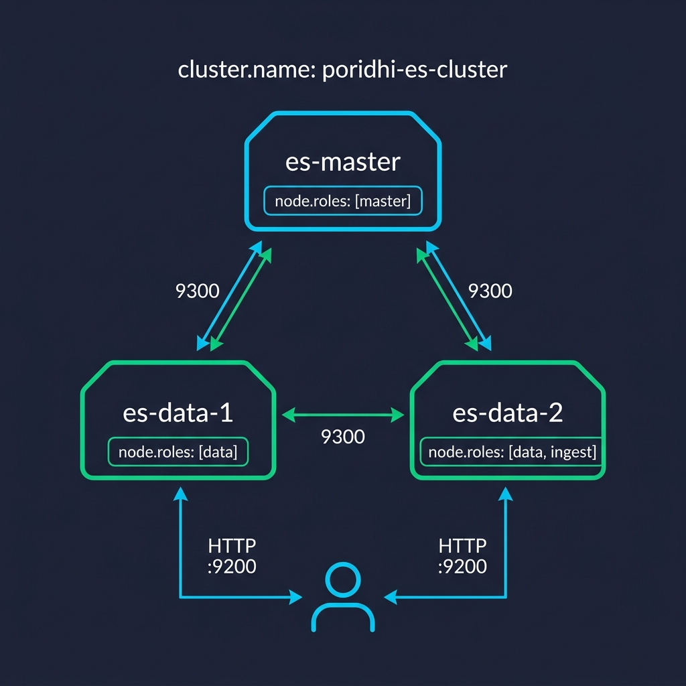

# Lab 50: Cluster Configuration

**Module 76 — Elasticsearch Cluster Setup**

This lab wires the three EC2 instances from lab-49 into a single Elasticsearch cluster. Each instance already has Elasticsearch 8.x installed by the user-data script from lab-49; this lab only edits `/etc/elasticsearch/elasticsearch.yml` on each node so they share a `cluster.name`, declare distinct `node.roles`, and discover each other by their private IPs. By the end you have one green cluster with one master-eligible node and two data nodes.

## Architecture

<p align="center"></p>

## Concept

| Term                          | Description                                                                                            |
|-------------------------------|--------------------------------------------------------------------------------------------------------|
| `cluster.name`                | A string all nodes must share to form the same cluster. Nodes with different cluster names ignore each other. |
| `node.name`                   | A human-readable identifier for a single node, visible in the cluster state and logs.                  |
| `node.roles`                  | A list that controls what a node does. Common roles: `master`, `data`, `ingest`.                       |
| Master-eligible node          | A node with the `master` role. It can be elected to manage cluster state, index metadata, and shard allocation. |
| Data node                     | A node with the `data` role. It stores index shards and runs search and indexing operations.           |
| Ingest node                   | A node with the `ingest` role. It runs ingest pipelines to transform documents before indexing.        |
| `discovery.seed_hosts`        | A list of host addresses the node contacts to discover other cluster members. Use private IPs in EC2. |
| `cluster.initial_master_nodes`| A one-time bootstrap list of master-eligible node names. Used only on the very first cluster start.    |
| `GET /_cluster/health`        | The API endpoint that reports cluster status — `green`/`yellow`/`red`, master node, and shard counts.   |

Elasticsearch discovers peers via `discovery.seed_hosts`. On EC2 we use private IPs (for example `10.0.1.10`, `10.0.1.11`, `10.0.1.12`) because every instance lives in the same VPC and the security group opens 9200 and 9300 to the VPC CIDR. Lab-49 provisioned these instances and the security group; you do not need to recreate them.

## What You Will Configure

A single Elasticsearch cluster named `docker-cluster` — chosen because that is the value shipped with `elasticsearch.yml` on each node from lab-49's user-data, so we only need to **edit** the file on each instance instead of rebuilding from scratch. Each instance keeps the default `cluster.name` and gains its own `node.name` and `node.roles`:

| Node           | Private IP (example) | `node.name`     | `node.roles`        | What it does                                       |
|----------------|----------------------|-----------------|---------------------|----------------------------------------------------|
| `es-master`    | `10.0.1.10`          | `es-master`     | `[master]`          | Owns cluster state, no data stored                 |
| `es-data-1`    | `10.0.1.11`          | `es-data-1`     | `[data]`            | Stores index shards, runs queries                  |
| `es-data-2`    | `10.0.1.12`          | `es-data-2`     | `[data, ingest]`    | Stores shards and runs ingest pipelines            |

After the restart, the three nodes form a 3-node cluster with one master-eligible, two data-eligible, and one ingest-capable node. The cluster reports `green` once the unassigned shards (from the still-allocated shards on the master, which has no `data` role) settle into a steady state.

## Prerequisites

- **Lab-49 completed**: three `t3.medium` instances running on Ubuntu 24.04 with Elasticsearch 8.x installed by user-data. From your terminal you have the three instance IDs (`es-master.id`, `es-data-1.id`, `es-data-2.id`) and the `instances.txt` file from lab-49.
- **AWS credentials** in the same shell session as lab-49 (`AWS_REGION` exported, `aws sts get-caller-identity` succeeds).
- **SSH access to each instance** using `es-lab-key.pem` from lab-49 (kept in `~/lab-49`).
- **The three instances running** — Step 1 of this lab checks that before editing config.

> **Cost note.** Three `t3.medium` instances still run while you do this lab (about $0.12/hr). Stop them when finished via `aws ec2 stop-instances --region "$AWS_REGION" --instance-ids "$(cat es-master.id)" "$(cat es-data-1.id)" "$(cat es-data-2.id)"`.

## Step 1: Confirm the three instances are running

If you came straight from lab-49 you can skip this. Otherwise, cd back into the lab-49 working directory and verify each instance is `running`:

```bash
cd ~/lab-49

for f in es-master.id es-data-1.id es-data-2.id; do
  INSTANCE_ID=$(cat "$f")
  STATE=$(aws ec2 describe-instances \
    --region "$AWS_REGION" \
    --instance-ids "$INSTANCE_ID" \
    --query 'Reservations[0].Instances[0].State.Name' \
    --output text)
  echo "$INSTANCE_ID -> $STATE"
done
```

Expected output:

```
i-0aaa1111aaaa1111aa -> running
i-0bbb2222bbbb2222bb -> running
i-0ccc3333cccc3333cc -> running
```

If any instance is `stopped`, start it:

```bash
aws ec2 start-instances \
  --region "$AWS_REGION" \
  --instance-ids "$(cat es-master.id)" "$(cat es-data-1.id)" "$(cat es-data-2.id)"

for f in es-master.id es-data-1.id es-data-2.id; do
  aws ec2 wait instance-running \
    --region "$AWS_REGION" \
    --instance-ids "$(cat "$f")"
done
```

## Step 2: Re-collect public IPs and confirm SSH + Elasticsearch on each node

Lab-49 stored a snapshot of public IPs in `instances.txt`. If the instances were stopped and restarted, AWS assigns new public IPs. Refresh `instances.txt` and confirm you can reach Elasticsearch on every node:

```bash
> instances.txt
for f in es-master.id es-data-1.id es-data-2.id; do
  INSTANCE_ID=$(cat "$f")
  PUBLIC_IP=$(aws ec2 describe-instances \
    --region "$AWS_REGION" \
    --instance-ids "$INSTANCE_ID" \
    --query 'Reservations[0].Instances[0].PublicIpAddress' \
    --output text)
  echo "$INSTANCE_ID $PUBLIC_IP" >> instances.txt
done

cat instances.txt
```

Pick up the new IPs into shell variables:

```bash
ES_MASTER_IP=$(awk -v id="$(cat es-master.id)" '$1==id{print $2}' instances.txt)
ES_DATA1_IP=$(awk -v id="$(cat es-data-1.id)" '$1==id{print $2}' instances.txt)
ES_DATA2_IP=$(awk -v id="$(cat es-data-2.id)" '$1==id{print $2}' instances.txt)

echo "es-master: $ES_MASTER_IP"
echo "es-data-1: $ES_DATA1_IP"
echo "es-data-2: $ES_DATA2_IP"
```

Sanity check the local API from each node:

```bash
for ip in "$ES_MASTER_IP" "$ES_DATA1_IP" "$ES_DATA2_IP"; do
  echo "--- $ip ---"
  ssh -i es-lab-key.pem -o StrictHostKeyChecking=accept-new \
    ubuntu@"$ip" \
    'curl -sf http://localhost:9200 >/dev/null && echo OK || echo NOT READY'
done
```

Expected output: three lines ending in `OK`. If a node prints `NOT READY`, wait for the user-data script to finish (the journalctl tail in lab-49 Step 9 is the quickest diagnostic).

## Step 3: Capture the private IPs

`discovery.seed_hosts` needs addresses the three nodes can reach from inside the VPC. EC2 private IPs are stable across stop/start cycles, so they are the right thing to put in cluster config:

```bash
> private-ips.txt
for f in es-master.id es-data-1.id es-data-2.id; do
  INSTANCE_ID=$(cat "$f")
  PRIVATE_IP=$(aws ec2 describe-instances \
    --region "$AWS_REGION" \
    --instance-ids "$INSTANCE_ID" \
    --query 'Reservations[0].Instances[0].PrivateIpAddress' \
    --output text)
  echo "$INSTANCE_ID $PRIVATE_IP" >> private-ips.txt
done

cat private-ips.txt
```

Expected output (your IPs will differ):

```
i-0aaa1111aaaa1111aa 10.0.1.10
i-0bbb2222bbbb2222bb 10.0.1.11
i-0ccc3333cccc3333cc 10.0.1.12
```

Pick up the private IPs into shell variables:

```bash
ES_MASTER_PRIVATE=$(awk -v id="$(cat es-master.id)" '$1==id{print $2}' private-ips.txt)
ES_DATA1_PRIVATE=$(awk -v id="$(cat es-data-1.id)" '$1==id{print $2}' private-ips.txt)
ES_DATA2_PRIVATE=$(awk -v id="$(cat es-data-2.id)" '$1==id{print $2}' private-ips.txt)

echo "Private IPs:"
echo "  es-master = $ES_MASTER_PRIVATE"
echo "  es-data-1 = $ES_DATA1_PRIVATE"
echo "  es-data-2 = $ES_DATA2_PRIVATE"
```

These three IPs are what you paste into `discovery.seed_hosts` on every node.

## Step 4: Write the per-instance elasticsearch.yml

Three files, one per role. Save them on your local machine first so you can `scp` them up in Step 5:

```bash
mkdir -p ~/lab-50 && cd ~/lab-50

cat > es-master.yml <<'YML'
cluster.name: docker-cluster
node.name: es-master
node.roles: [master]
network.host: 0.0.0.0
http.port: 9200
discovery.seed_hosts:
  - ES_DATA1_PRIVATE
  - ES_DATA2_PRIVATE
cluster.initial_master_nodes:
  - es-master
YML

cat > es-data-1.yml <<'YML'
cluster.name: docker-cluster
node.name: es-data-1
node.roles: [data]
network.host: 0.0.0.0
http.port: 9200
discovery.seed_hosts:
  - ES_MASTER_PRIVATE
  - ES_DATA2_PRIVATE
YML

cat > es-data-2.yml <<'YML'
cluster.name: docker-cluster
node.name: es-data-2
node.roles: [data, ingest]
network.host: 0.0.0.0
http.port: 9200
discovery.seed_hosts:
  - ES_MASTER_PRIVATE
  - ES_DATA1_PRIVATE
YML
```

Replace the four `*_PRIVATE` placeholders with the actual addresses captured in Step 3. Use `sed` so the YAML quoting does not have to change:

```bash
sed -i \
  -e "s/ES_MASTER_PRIVATE/$ES_MASTER_PRIVATE/g" \
  -e "s/ES_DATA1_PRIVATE/$ES_DATA1_PRIVATE/g" \
  -e "s/ES_DATA2_PRIVATE/$ES_DATA2_PRIVATE/g" \
  es-master.yml es-data-1.yml es-data-2.yml
```

Quick sanity check — each file should now show the actual IPs:

```bash
grep -h 'discovery.seed_hosts:' -A3 es-master.yml es-data-1.yml es-data-2.yml
```

> Note on `cluster.name`: lab-49's user-data script leaves `cluster.name: elasticsearch` (the Elasticsearch default). This lab changes it to `docker-cluster` everywhere so the three nodes agree on the same cluster name. The name string is arbitrary — pick anything consistent across all three nodes.

## Step 5: Copy each config to its instance

Push the per-role YAML into place on the matching instance. The Ubuntu AMI ships with `sudo` and passwordless sudo for the `ubuntu` user, so the next ssh call uses `sudo tee` to write into `/etc/elasticsearch/`:

```bash
scp -i ~/lab-49/es-lab-key.pem -o StrictHostKeyChecking=accept-new \
  es-master.yml ubuntu@"$ES_MASTER_IP":/tmp/elasticsearch.yml

ssh -i ~/lab-49/es-lab-key.pem -o StrictHostKeyChecking=accept-new \
  ubuntu@"$ES_MASTER_IP" \
  'sudo cp /etc/elasticsearch/elasticsearch.yml /etc/elasticsearch/elasticsearch.yml.bak \
    && sudo tee /etc/elasticsearch/elasticsearch.yml >/dev/null < /tmp/elasticsearch.yml \
    && sudo chown root:elasticsearch /etc/elasticsearch/elasticsearch.yml \
    && sudo chmod 660 /etc/elasticsearch/elasticsearch.yml'
```

Repeat for `es-data-1.yml` → `es-data-1` and `es-data-2.yml` → `es-data-2`. A small loop keeps the command count down:

```bash
for pair in "es-data-1:$ES_DATA1_IP" "es-data-2:$ES_DATA2_IP"; do
  NAME="${pair%%:*}"
  IP="${pair##*:}"
  scp -i ~/lab-49/es-lab-key.pem -o StrictHostKeyChecking=accept-new \
    "$NAME.yml" ubuntu@"$IP":/tmp/elasticsearch.yml

  ssh -i ~/lab-49/es-lab-key.pem -o StrictHostKeyChecking=accept-new \
    ubuntu@"$IP" \
    'sudo cp /etc/elasticsearch/elasticsearch.yml /etc/elasticsearch/elasticsearch.yml.bak
     sudo tee /etc/elasticsearch/elasticsearch.yml >/dev/null < /tmp/elasticsearch.yml
     sudo chown root:elasticsearch /etc/elasticsearch/elasticsearch.yml
     sudo chmod 660 /etc/elasticsearch/elasticsearch.yml'
done
```

Verify each node sees its expected `node.name` and `node.roles` before restarting:

```bash
for pair in "es-master:$ES_MASTER_IP" "es-data-1:$ES_DATA1_IP" "es-data-2:$ES_DATA2_IP"; do
  NAME="${pair%%:*}"
  IP="${pair##*:}"
  echo "--- $NAME ($IP) ---"
  ssh -i ~/lab-49/es-lab-key.pem ubuntu@"$IP" \
    'sudo grep -E "^(cluster.name|node.name|node.roles|discovery.seed_hosts)" /etc/elasticsearch/elasticsearch.yml'
done
```

Expected output:

```
--- es-master (...)
cluster.name: docker-cluster
node.name: es-master
node.roles: [master]
discovery.seed_hosts:
  - <es-data-1 private>
  - <es-data-2 private>
--- es-data-1 (...)
cluster.name: docker-cluster
node.name: es-data-1
node.roles: [data]
discovery.seed_hosts:
  - <es-master private>
  - <es-data-2 private>
--- es-data-2 (...)
cluster.name: docker-cluster
node.name: es-data-2
node.roles: [data, ingest]
discovery.seed_hosts:
  - <es-master private>
  - <es-data-1 private>
```

## Step 6: Restart Elasticsearch on every node

Each instance runs Elasticsearch as a systemd service (lab-49's user-data enabled it). Restart them in any order — the cluster forms when enough master-eligible nodes are reachable:

```bash
for pair in "es-master:$ES_MASTER_IP" "es-data-1:$ES_DATA1_IP" "es-data-2:$ES_DATA2_IP"; do
  NAME="${pair%%:*}"
  IP="${pair##*:}"
  echo "Restarting $NAME..."
  ssh -i ~/lab-49/es-lab-key.pem ubuntu@"$IP" \
    'sudo systemctl restart elasticsearch.service'
done
```

Wait for Elasticsearch to come back up on each node. The service takes 15–30 seconds to rejoin a cluster from cold start:

```bash
for pair in "es-master:$ES_MASTER_IP" "es-data-1:$ES_DATA1_IP" "es-data-2:$ES_DATA2_IP"; do
  NAME="${pair%%:*}"
  IP="${pair##*:}"
  echo "--- waiting for $NAME ---"
  ssh -i ~/lab-49/es-lab-key.pem ubuntu@"$IP" \
    'for i in $(seq 1 30); do
       if curl -sf http://localhost:9200 >/dev/null 2>&1; then
         echo "  up after ${i} attempts"
         exit 0
       fi
       sleep 3
     done
     echo "  did not come up in time"
     sudo journalctl -u elasticsearch --no-pager -n 80
     exit 1'
done
```

Expected output: three lines ending in `up after N attempts`.

## Step 7: Check cluster health from the master

`GET /_cluster/health` reports the cluster's status, the elected master, and the shard counts. Run it from the master so you can act on the result immediately:

```bash
ssh -i ~/lab-49/es-lab-key.pem ubuntu@"$ES_MASTER_IP" \
  'curl -s http://localhost:9200/_cluster/health?pretty'
```

Expected output:

```json
{
  "cluster_name" : "docker-cluster",
  "status" : "green",
  "timed_out" : false,
  "number_of_nodes" : 3,
  "number_of_data_nodes" : 2,
  "active_primary_shards" : 0,
  "active_shards" : 0,
  "relocating_shards" : 0,
  "initializing_shards" : 0,
  "unassigned_shards" : 0,
  "delayed_unassigned_shards" : 0,
  "number_of_pending_tasks" : 0,
  "number_of_in_flight_fetch" : 0,
  "task_max_waiting_in_millis" : 0,
  "active_shards_percent_as_number" : 100.0
}
```

What each line tells you:

- `cluster_name: docker-cluster` — all three nodes agree on the name, so they joined the same cluster.
- `status: green` — every shard is allocated. `yellow` would mean indices with unassigned replicas; `red` means primary shards are missing.
- `number_of_nodes: 3` — all three instances are members.
- `number_of_data_nodes: 2` — `es-data-1` and `es-data-2` carry the `data` role; `es-master` does not, by design.
- `active_shards_percent_as_number: 100.0` — no shards are stuck waiting for assignment.

If `status` is `yellow` or `red`, jump to Step 9 for the diagnostic flow before re-checking.

## Step 8: List the cluster members

`GET /_cat/nodes` returns one row per node with its name, role set, and which node holds the master title:

```bash
ssh -i ~/lab-49/es-lab-key.pem ubuntu@"$ES_MASTER_IP" \
  'curl -s "http://localhost:9200/_cat/nodes?v&pretty"'
```

Expected output:

```
ip          heap.percent ram.percent cpu load_1m load_5m load_15m node.role node.name    cluster.name
10.0.1.10            18          72   2    0.06    0.07     0.05 m         es-master    docker-cluster
10.0.1.11            22          74   3    0.05    0.08     0.04 d         es-data-1    docker-cluster
10.0.1.12            21          73   2    0.04    0.06     0.03 di        es-data-2    docker-cluster
```

Read the columns:

- `node.role` is a one-letter code per role: `m` = master, `d` = data, `i` = ingest. `es-data-2` shows `di` because it has both `data` and `ingest`.
- `cluster.name` matches across all three rows, confirming a single cluster.
- A `*` marker in the raw `_cat/nodes` API indicates which node is the elected master. The `master` column appears when you pass `?h=ip,node.role,node.name,master`:

```bash
ssh -i ~/lab-49/es-lab-key.pem ubuntu@"$ES_MASTER_IP" \
  'curl -s "http://localhost:9200/_cat/nodes?h=ip,node.role,node.name,master&pretty"'
```

Expected output (one row has `-` for master, the elected master has `*`):

```
ip          node.role node.name    master
10.0.1.10   m         es-master    *
10.0.1.11   d         es-data-1    -
10.0.1.12   di        es-data-2    -
```

Because only one node (`es-master`) is master-eligible, it always wins the election. Adding more `master`-role nodes introduces a quorum — covered in a later lab.

## Step 9: Troubleshooting

If `GET /_cluster/health` reports `yellow` or `red`, or `number_of_nodes` is less than 3, work through these checks.

### Check 1 — the three nodes can reach each other on 9300

```bash
ssh -i ~/lab-49/es-lab-key.pem ubuntu@"$ES_MASTER_IP" \
  "for ip in $ES_DATA1_PRIVATE $ES_DATA2_PRIVATE; do
     echo -n \"\$ip:9300 \"
     timeout 3 bash -c \"</dev/tcp/\$ip/9300\" 2>&1 && echo OK || echo FAIL
   done"
```

Expected output: both lines end with `OK`. `FAIL` means the security group is missing the 9300 rule on the VPC CIDR — go back to lab-49 Step 4 and add it.

### Check 2 — the cluster logs show discovery / election errors

```bash
ssh -i ~/lab-49/es-lab-key.pem ubuntu@"$ES_MASTER_IP" \
  'sudo journalctl -u elasticsearch --no-pager -n 200 | grep -E "master|discovery|seed" | tail -40'
```

Common lines to look for:

- `master not discovered or elected yet, an election requires one or more nodes with the master role` — at least one node's `node.roles` does not contain `master`. Re-check Step 5.
- `failed to send join request to master ... connection refused` — network reachability on 9300 between nodes (Check 1).
- `cluster.name ... does not match local cluster.name` — one node's `cluster.name` differs from the others. Diff the three YAML files.

### Check 3 — config drift

Diff the active config across all three nodes. Each row should report the same `cluster.name` and the role-appropriate `node.roles`:

```bash
for pair in "es-master:$ES_MASTER_IP" "es-data-1:$ES_DATA1_IP" "es-data-2:$ES_DATA2_IP"; do
  NAME="${pair%%:*}"
  IP="${pair##*:}"
  echo "--- $NAME ---"
  ssh -i ~/lab-49/es-lab-key.pem ubuntu@"$IP" \
    'sudo awk "/^(cluster.name|node.name|node.roles|discovery.seed_hosts)/,/^$/" /etc/elasticsearch/elasticsearch.yml'
done
```

If any node differs, edit it (Step 5) and restart (Step 6).

### Check 4 — heap pressure

Three t3.medium instances have 4 GB RAM each. Elasticsearch 8.x defaults to 50% of RAM for the JVM heap, capped at 32 GB — that is roughly 2 GB per node. Lab-49's user-data pins it to 512 MB via `/etc/elasticsearch/jvm.options.d/heap.options`. If you removed that pin, every node would try to claim 2 GB and one of them would be OOM-killed:

```bash
ssh -i ~/lab-49/es-lab-key.pem ubuntu@"$ES_MASTER_IP" \
  'cat /etc/elasticsearch/jvm.options.d/heap.options && \
   free -m'
```

Expected: `-Xms512m` and `-Xmx512m` on the first two lines, and `free -m` shows at least 1.5 GB of free memory.

## Step 10: Stop the cluster when you are done

You have two options — the same ones lab-49 Step 12 covers:

```bash
# Option A — stop (keeps data, no compute charges)
aws ec2 stop-instances \
  --region "$AWS_REGION" \
  --instance-ids "$(cat es-master.id)" "$(cat es-data-1.id)" "$(cat es-data-2.id)"

# Option B — terminate (deletes everything)
aws ec2 terminate-instances \
  --region "$AWS_REGION" \
  --instance-ids "$(cat es-master.id)" "$(cat es-data-1.id)" "$(cat es-data-2.id)"
```

If you intend to continue with the next lab (indexing and search), leave the instances running and skip this step.

## Quick run (copy-paste safe)

A single-paste bundle that walks through Steps 1–8. Each SSH call blocks until Elasticsearch answers on 9200, so the cluster forms by the time you see the final health output:

```bash
set -euo pipefail

: "${AWS_REGION:=us-east-1}"
export AWS_REGION

cd ~/lab-49

# Step 1 — instances running
for f in es-master.id es-data-1.id es-data-2.id; do
  aws ec2 wait instance-running \
    --region "$AWS_REGION" \
    --instance-ids "$(cat "$f")"
done

# Step 2 — public IPs
> instances.txt
for f in es-master.id es-data-1.id es-data-2.id; do
  INSTANCE_ID=$(cat "$f")
  PUBLIC_IP=$(aws ec2 describe-instances \
    --region "$AWS_REGION" --instance-ids "$INSTANCE_ID" \
    --query 'Reservations[0].Instances[0].PublicIpAddress' --output text)
  echo "$INSTANCE_ID $PUBLIC_IP" >> instances.txt
done

ES_MASTER_IP=$(awk -v id="$(cat es-master.id)" '$1==id{print $2}' instances.txt)
ES_DATA1_IP=$(awk  -v id="$(cat es-data-1.id)"  '$1==id{print $2}' instances.txt)
ES_DATA2_IP=$(awk  -v id="$(cat es-data-2.id)"  '$1==id{print $2}' instances.txt)

# Step 3 — private IPs
> private-ips.txt
for f in es-master.id es-data-1.id es-data-2.id; do
  INSTANCE_ID=$(cat "$f")
  PRIVATE_IP=$(aws ec2 describe-instances \
    --region "$AWS_REGION" --instance-ids "$INSTANCE_ID" \
    --query 'Reservations[0].Instances[0].PrivateIpAddress' --output text)
  echo "$INSTANCE_ID $PRIVATE_IP" >> private-ips.txt
done

ES_MASTER_PRIVATE=$(awk -v id="$(cat es-master.id)" '$1==id{print $2}' private-ips.txt)
ES_DATA1_PRIVATE=$(awk  -v id="$(cat es-data-1.id)"  '$1==id{print $2}' private-ips.txt)
ES_DATA2_PRIVATE=$(awk  -v id="$(cat es-data-2.id)"  '$1==id{print $2}' private-ips.txt)

# Step 4 — render per-node configs
mkdir -p ~/lab-50 && cd ~/lab-50
for f in es-master.yml es-data-1.yml es-data-2.yml; do : > "$f"; done

cat > es-master.yml <<YML
cluster.name: docker-cluster
node.name: es-master
node.roles: [master]
network.host: 0.0.0.0
http.port: 9200
discovery.seed_hosts:
  - $ES_DATA1_PRIVATE
  - $ES_DATA2_PRIVATE
cluster.initial_master_nodes:
  - es-master
YML

cat > es-data-1.yml <<YML
cluster.name: docker-cluster
node.name: es-data-1
node.roles: [data]
network.host: 0.0.0.0
http.port: 9200
discovery.seed_hosts:
  - $ES_MASTER_PRIVATE
  - $ES_DATA2_PRIVATE
YML

cat > es-data-2.yml <<YML
cluster.name: docker-cluster
node.name: es-data-2
node.roles: [data, ingest]
network.host: 0.0.0.0
http.port: 9200
discovery.seed_hosts:
  - $ES_MASTER_PRIVATE
  - $ES_DATA1_PRIVATE
YML

# Step 5 — copy each config to its instance
deploy() {
  local name="$1" ip="$2"
  scp -i ~/lab-49/es-lab-key.pem -o StrictHostKeyChecking=accept-new \
    "$name.yml" "ubuntu@${ip}:/tmp/elasticsearch.yml"
  ssh -i ~/lab-49/es-lab-key.pem -o StrictHostKeyChecking=accept-new \
    "ubuntu@${ip}" \
    'sudo cp /etc/elasticsearch/elasticsearch.yml /etc/elasticsearch/elasticsearch.yml.bak
     sudo tee /etc/elasticsearch/elasticsearch.yml >/dev/null < /tmp/elasticsearch.yml
     sudo chown root:elasticsearch /etc/elasticsearch/elasticsearch.yml
     sudo chmod 660 /etc/elasticsearch/elasticsearch.yml'
}

deploy es-master "$ES_MASTER_IP"
deploy es-data-1  "$ES_DATA1_IP"
deploy es-data-2  "$ES_DATA2_IP"

# Step 6 — restart and wait
for pair in "es-master:$ES_MASTER_IP" "es-data-1:$ES_DATA1_IP" "es-data-2:$ES_DATA2_IP"; do
  NAME="${pair%%:*}"; IP="${pair##*:}"
  ssh -i ~/lab-49/es-lab-key.pem "ubuntu@${IP}" \
    'sudo systemctl restart elasticsearch.service'
done

for pair in "es-master:$ES_MASTER_IP" "es-data-1:$ES_DATA1_IP" "es-data-2:$ES_DATA2_IP"; do
  NAME="${pair%%:*}"; IP="${pair##*:}"
  ssh -i ~/lab-49/es-lab-key.pem "ubuntu@${IP}" \
    'for i in $(seq 1 30); do
       if curl -sf http://localhost:9200 >/dev/null 2>&1; then
         echo "${NAME}: up after ${i} attempts"
         exit 0
       fi
       sleep 3
     done
     echo "${NAME}: did not come up in time"
     sudo journalctl -u elasticsearch --no-pager -n 80
     exit 1'
done

# Step 7 — cluster health
ssh -i ~/lab-49/es-lab-key.pem "ubuntu@${ES_MASTER_IP}" \
  'curl -s http://localhost:9200/_cluster/health?pretty'

# Step 8 — node list
ssh -i ~/lab-49/es-lab-key.pem "ubuntu@${ES_MASTER_IP}" \
  'curl -s "http://localhost:9200/_cat/nodes?v&pretty"'
```

Two things differ from the step-by-step version:

- The three YAML files are written with **unquoted heredocs** so the shell expands `$ES_*_PRIVATE` directly into the file. That avoids a `sed -i` pass after writing the configs.
- `deploy` is a small bash function so the same five-line `scp + ssh` block runs for all three nodes. The step-by-step version spells it out so the role-per-node mapping is obvious.

## Next Steps

This lab completes the cluster setup. You now have a working three-node Elasticsearch cluster with dedicated master, data, and ingest roles running on EC2. Follow-up labs extend this foundation with index management, mappings, and search operations.
